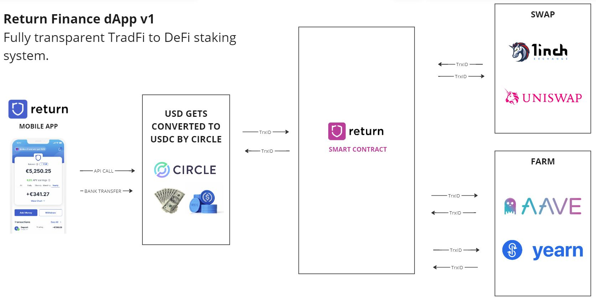

## Return Finance
We enable mass adoption of DeFi by a user-friendly savings app that lets you earn up to a 10% APY on your fiat USD.

## Project Description
Return Finance is building a bridge between the worlds of TradFi and DeFi via a platform designed for individuals and businesses to earn yield on their fiat USD. 

Funds received from the traditional banking system are automatically converted into USDC through the Circel API and provided as liquidity to some of the leading trading and lending protocols such as Curve, AAVE, Uniswap and more comprehensive dApps such as yEarn, Convex and Conic Finance. 

In a permissionless and fully-traceable way, the Return Finance smart contract receives the converted USDC and distributes it to various low-risk protocols following a predefined strategy. In future versions, the USDC will be swapped on the way in and way out for other stable currencies such as DAI and USDT to maximize the APY.



For the scope of this hackathon, we developed a simple web interface that simulates the depositing of USDC via the Circle API and the very first version of our smart contract.

More information about the project is available at https://return.finance/

### Run Front End

```bash
npm install
```
and then

```bash
npm start
```
### Smart Contract 

The Return Finance smart contract that acts as a yield-bearing vault is deployed on Optimism.

The ERC-4626 standard is used to optimize and unify the technical parameters of our vault.

The _depositToPools function distributes the deposited funds across USDC pools on AAVE and yEarn on Optimism.

The _withdrawFromPools function unstakes the provided liquidity from AAVE and yEarn and enables the user to withdraw the principal, plus any yield generated.

Live on Optimism: https://optimistic.etherscan.io/address/0xf68d87eb4a0b691cb186e6aae54b0870a3e4ef67
